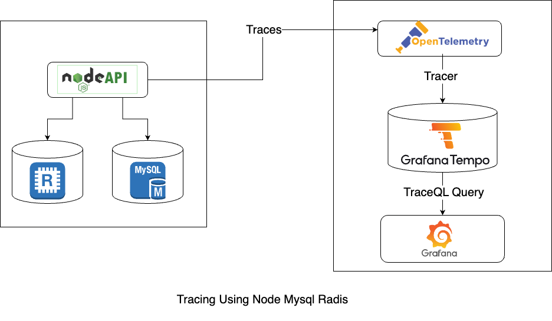

# Tracing a NodeJS App with OpenTelemetry and Grafana Tempo

## Overview

This project demonstrates how to implement distributed tracing in a Node.js application using OpenTelemetry and visualize the traces with Grafana Tempo. Tracing helps in monitoring and debugging applications by providing insights into the performance and behavior of services.

## Tracing Diagram



## Prerequisites

- Node.js (version 18 or higher)
- Redis (for caching, if applicable)
- MySQL (for database interactions)
- Grafana (for visualization)
- Tempo (for tracing)

## Installation

1. Clone the repository:

   ```bash
   git clone https://github.com/shipanmazumder/tracing
   cd tracing
   ```

2. Install the dependencies:

   ```bash
   npm install
   ```

## Tracing

The application is instrumented to trace requests and database interactions. Ensure that your services are properly configured to send traces to Grafana Tempo.

## License

This project is licensed under the MIT License.
